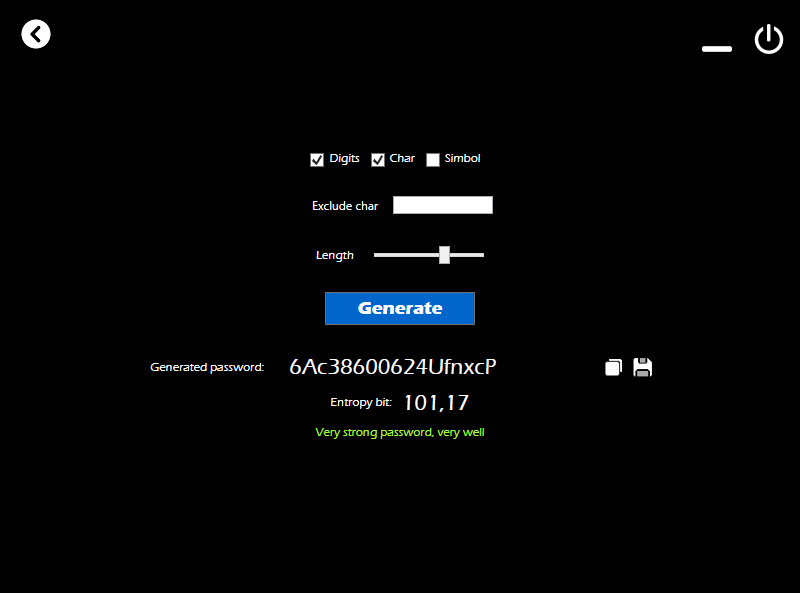
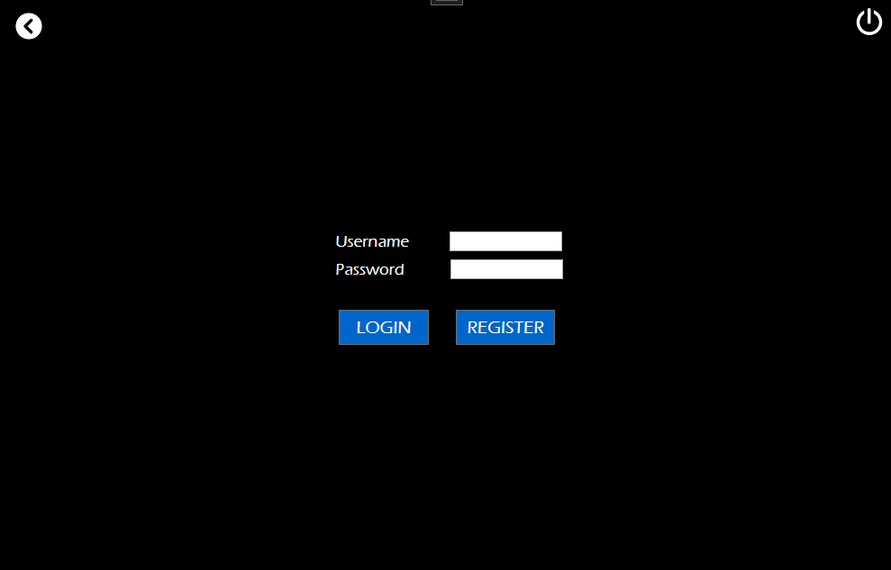
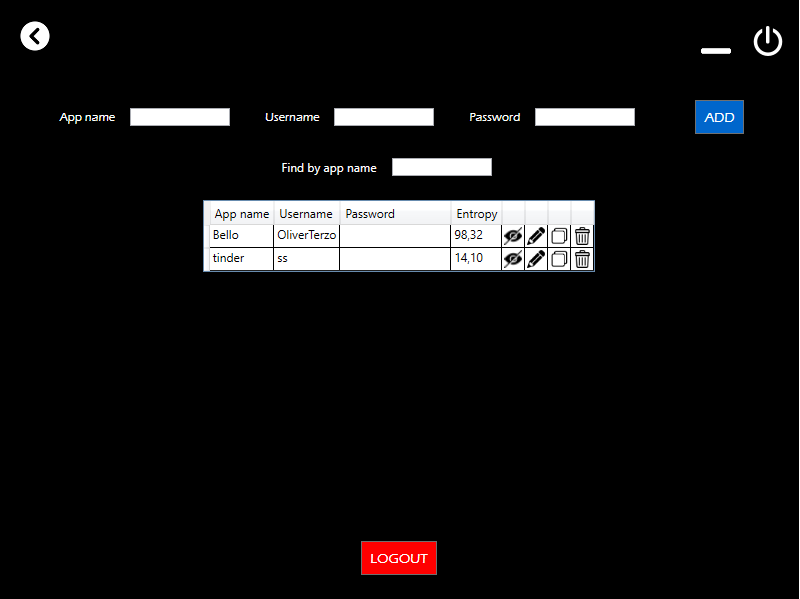

# Password Manager

## About

This project easy created with [WPF](https://en.wikipedia.org/wiki/Windows_Presentation_Foundation) in C# and it adds the possibility to create your custom password using the section `Create Password` and the possibility to recap your passwords in the section `Saved Password`

## Installation

This application needs a [.NET](https://dotnet.microsoft.com/en-us/download/dotnet/6.0) Desktop Runtime 6.0.1

Download the release and run the `PasswordManager.exe`

## Usage

### _Create Password_

In this section of the application, you can create your own password using one of the filter on the top. With the `Number` filter the password that is generated has the numbers between 0-9. With the `Alphabetic char` the password that is generated has a char between a-zA-Z. With the `Symbol` filter the password that is generated has all the symbols, e.g.: ./;:{}[]"`!@ ...

If you want you can change the length of the password that is created by using the slider: the length of the password is a minimum of `8` and a maximum of `22`.

There is another section that checks the password complexity and calculates the `entropy` of the password in bit: the more the entropy is high, the more the password is complex.

To copy the password that is generated, there is a little `copy-button` on its right.

### _Saved Password_

This section is protected by login interface. You can `register` your own account for the application: `only one account is allowed`. Or you can `login` and the user can see all the passwords saved on the application.
In this section you can also `add a password` inserting an app name, a username and a password. Than press the add button to save the data in the app.

## How it works

### _Generating password_

To generate the password the app uses a `GenPassword` class. The main method is `generate`: this method accepts the checkbox value of the filter and generates a password based on it. The generate method uses different sub-methods to create a specific value of the password. There is a `genNumber` method added to number generation: it generates a single number between 0-9. The `genChar` method generate a single char between a-zA-Z. I used the `Random` class of C# to generate a single char and create a number that is converted using the ascii table in a char that will be returned. The `genSymbol` method works similar to the `genChar`, indeed it uses the same Random class to generate a number that is converted in a symbol with the ascii table.

### _Entropy calculation_

To calculate the entropy of the password, the app uses the `EntropyCalc` class with the `entropy` method. I calculated the entropy bit using the formula E = L \* log2( R ) with L as the length of the password that is generated, and R as the pool size of the unique characters that create the password.

## Update

To check the future update: [Update](UPDATE.md)

---

Copyright 2022 by Terzo Oliver

Released by the [MIT License](LICENSE)
