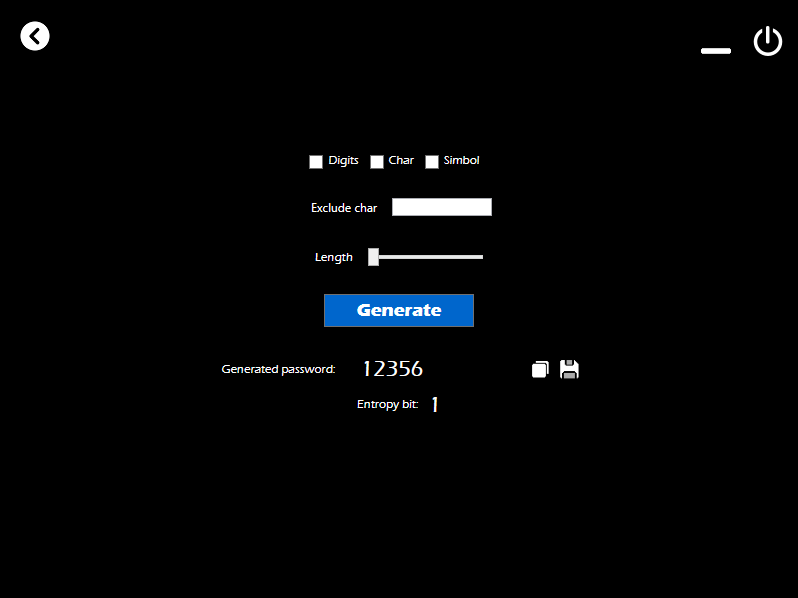

# Password Manager

## About

This project created with [WPF](https://en.wikipedia.org/wiki/Windows_Presentation_Foundation) in C#, add the possibility to create a custom password using the section `Create Password` and, the possibility to organize the password in the section `Saved Password` 

## Installation

There is no release in this moment, but if you want, copy the project and compile the solution with visual studio

## Usage

### _Create password_

In this section of application, you can create your own password, using one of the filter on the top; with `Number` filter the generated password had number between 0-9, with `Alphabetic char` the generated password had char between a-zA-Z, with `Simbol` filter the generated password had all the simbol for example: ./;:{}[]"`!@ ...

If you want, you can change the length of the generated password, by using the slider, the minimum length of the password is `8` and the maximum is `22`.

For check the password complexity there is another section that calculate the `entropy` of the password in bit, more is the entropy and more is the complexity of the password.

For copy the generated password, there is a small `copy-button` on the right of the generated password.

### _Saved password_

This section is protected by login interface, you can `register` an account for the application, `only one account is permitted`, or you can `login`, when the user is logged in he can see all the password saved in the application.

Also in this section you can `add a password` by inserting an app name, the username and the password, after that press the add button to save the data in the app

## How it works

### _Generating password_

For generating the password, the app use `GenPassword` class, the main method is `generate` this method accept the checkbox value of the filter, and generate a password based on this, the generate method use different sub-method to generate a specific value of the password, for the number generation there is a `genNumber` method that generate a single number between 0-9; the `genChar` method generate a single char between a-zA-Z, for generating a single char i used the `Random` class of C# for generate a number this number is converted using the ascii table in a char that will be returned; the `genSimbol` method works similar to genChar, in facts using the same Random class for generate a number that is converted in a simbol with the ascii table. 

### _Entropy calculation_

For calculating the entropy of the password, the app use the `EntropyCalc` class, with the method `entropy` i calculate the the entropy bit using the formula E = L * log2( R ) with L the length of the generated password, and R the pool size of the unique characters from which we build the password

## Update

To check the future update, check [Update](UPDATE.md)

---

Copyright 2022 by Terzo Oliver

Released under the [MIT License](LICENSE)